[← HTTP Samples](../README.md)

# OneLogin JIT Account Lifecycle and Role Elevation

This sample is a JIT-focused add-on for OneLogin environments already managed through a separate Generic REST connector. It validates OAuth client credentials, enables or disables users, and elevates or demotes users by assigning or removing OneLogin roles.

**Platform Script:** [`OneLogin_GRC_JIT_addon.json`](./OneLogin_GRC_JIT_addon.json)

## Target System

OneLogin users and role assignments used in Safeguard JIT access workflows.

## Operations Implemented

| Operation | Description |
| --- | --- |
| `CheckSystem` | Requests an OAuth access token with the configured client credentials, then revokes it to verify connectivity and credentials. |
| `ChangePassword` | Placeholder only; logs that password changes are not supported and returns `false`. |
| `EnableAccount` | Looks up the user by username and sets the OneLogin status to enabled. |
| `DisableAccount` | Looks up the user by username and sets the OneLogin status to disabled. |
| `ElevateAccount` | Resolves each requested OneLogin role in `PrivilegeGroupMembership`, assigns the user to those roles, and polls until the assignments are visible. |
| `DemoteAccount` | Resolves each requested OneLogin role in `PrivilegeGroupMembership`, removes the user from those roles, and polls until the removals are visible. |

## Prerequisites

- SPP 6.0 or later
- Network access from SPP to the OneLogin API endpoint in `Address`
- A separate OneLogin Generic REST connector already managing the base asset, account, and entitlement inventory
- OneLogin OAuth client credentials with rights to manage users and roles; configure the client ID as `FuncUsername` and the client secret as `FuncPassword`

## Deployment

1. Upload the script: `Import-SafeguardCustomPlatformScript -FilePath ./OneLogin_GRC_JIT_addon.json`
2. Create a custom platform using this script
3. Create an asset using the platform
4. Configure service account, managed account(s), and JIT role mappings for `PrivilegeGroupMembership`
5. Test with `Test-SafeguardAsset -ExtendedLogging`, then exercise the access-request workflows that call `EnableAccount`, `DisableAccount`, `ElevateAccount`, and `DemoteAccount`

## Configuration Walkthrough

The `assets/` folder contains numbered screenshots and a video (`http_oneloginjit_1.mp4`) showing the full configuration end-to-end. The steps below explain what each screenshot shows.

### Step 1 — Upload the Platform Script

Navigate to **Asset Management → Connect and Platforms → Custom Platforms** and click the **+** button to create a new platform.

| Screenshot | What it shows |
| --- | --- |
| 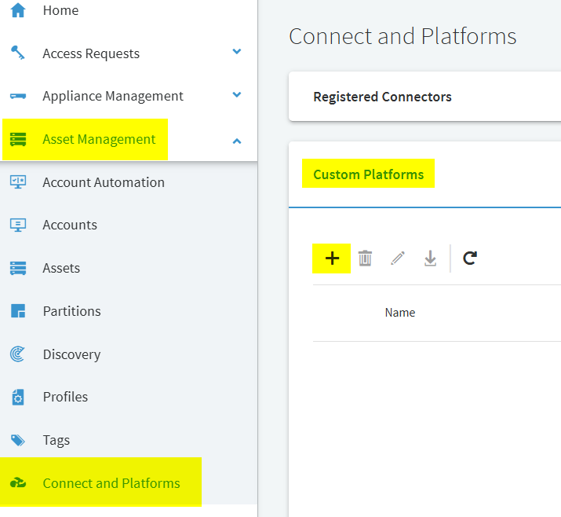 | Finding the Custom Platforms section under Connect and Platforms. |
| 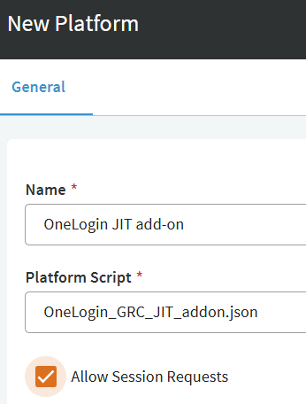 | Creating the platform named "OneLogin JIT add-on" and selecting the uploaded script. |

### Step 2 — Understand Your OneLogin Roles

Before creating assets, identify the OneLogin roles you want to use for JIT elevation. Each role maps to a cloud application.

| Screenshot | What it shows |
| --- | --- |
| 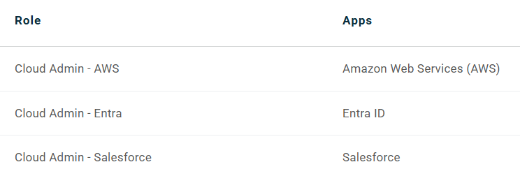 | OneLogin roles (Cloud Admin - AWS, Cloud Admin - Entra, Cloud Admin - Salesforce) and their associated apps. |

### Step 3 — Create JIT Assets

Create one asset per role/cloud application. All assets use the same "OneLogin JIT add-on" platform and point to your OneLogin API endpoint.

| Screenshot | What it shows |
| --- | --- |
| 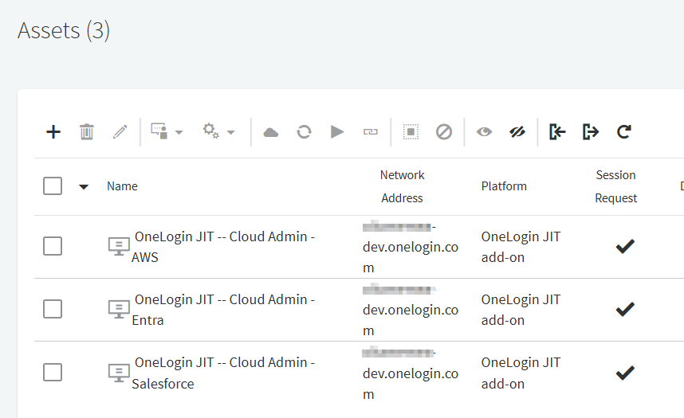 | Three JIT assets created — one per cloud admin role — all using the OneLogin JIT add-on platform. |

### Step 4 — Configure Accounts

Add a service account (OAuth client credentials) and managed accounts to the JIT assets.

| Screenshot | What it shows |
| --- | --- |
| 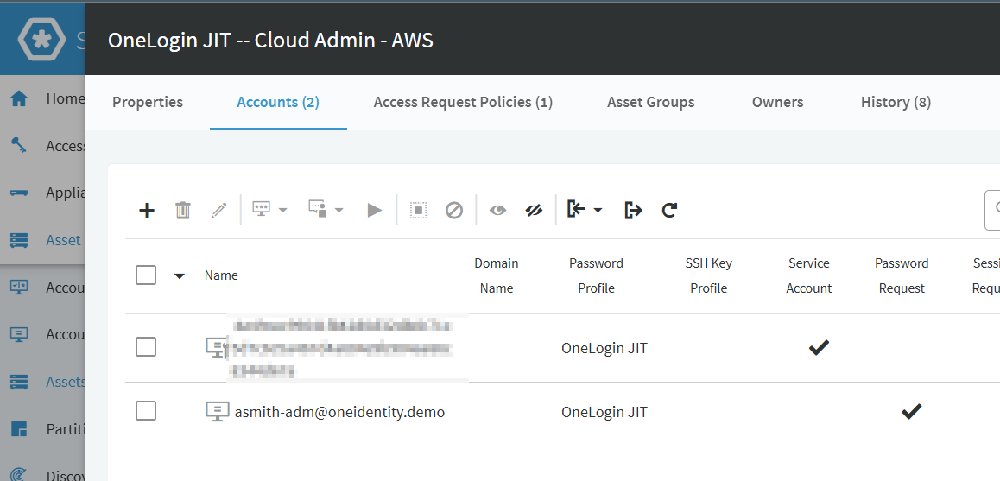 | The "Cloud Admin - AWS" asset with a service account and managed account (asmith-adm@oneidentity.demo). |
| 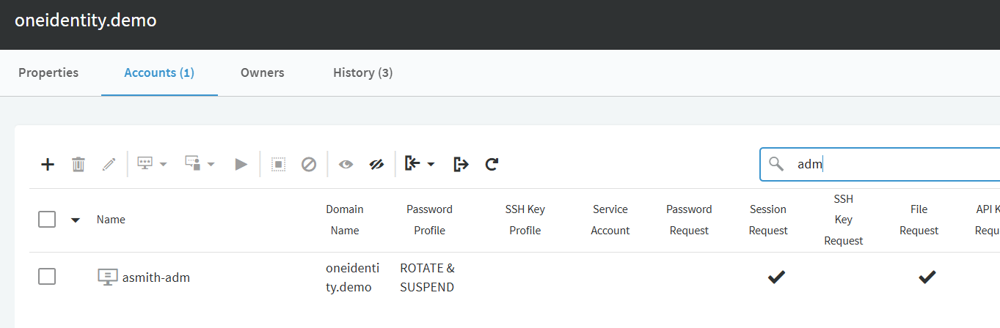 | The base OneLogin asset showing the `asmith-adm` account with domain, password profile, and session request enabled. |

### Step 5 — Set JIT Privilege Group Membership

On each managed account's **Management** tab, configure the **JIT Privilege Group Membership** field with the OneLogin role name that should be granted during elevation.

| Screenshot | What it shows |
| --- | --- |
| 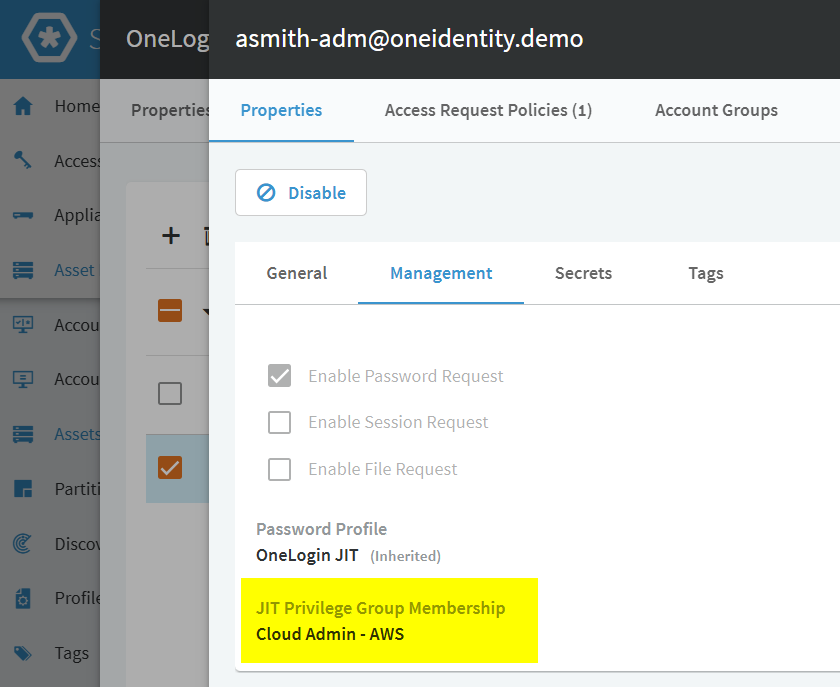 | The managed account's Management tab with "JIT Privilege Group Membership" set to "Cloud Admin - AWS". This is the role the script will assign during `ElevateAccount`. |

### Step 6 — Create an Account Group with Dynamic Rules

Create an account group that dynamically discovers all JIT-managed accounts using Account Rules.

| Screenshot | What it shows |
| --- | --- |
| 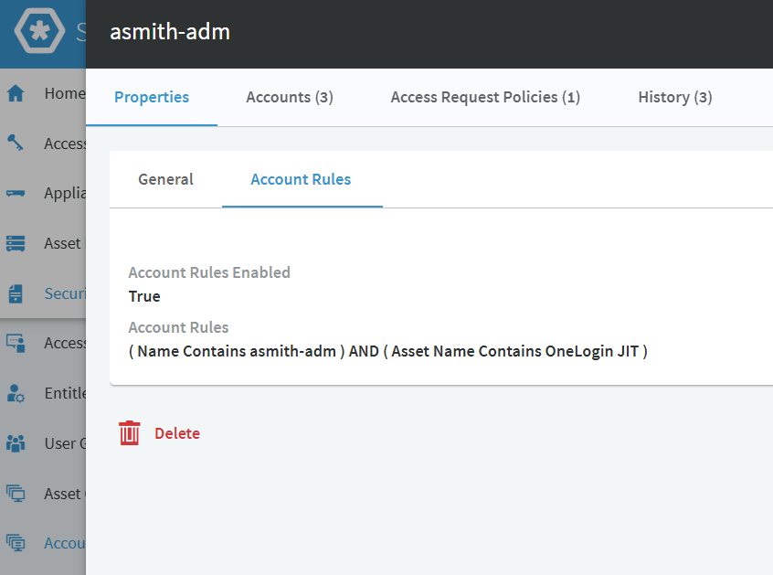 | The `asmith-adm` account group with rules: (Name Contains asmith-adm) AND (Asset Name Contains OneLogin JIT). |
| 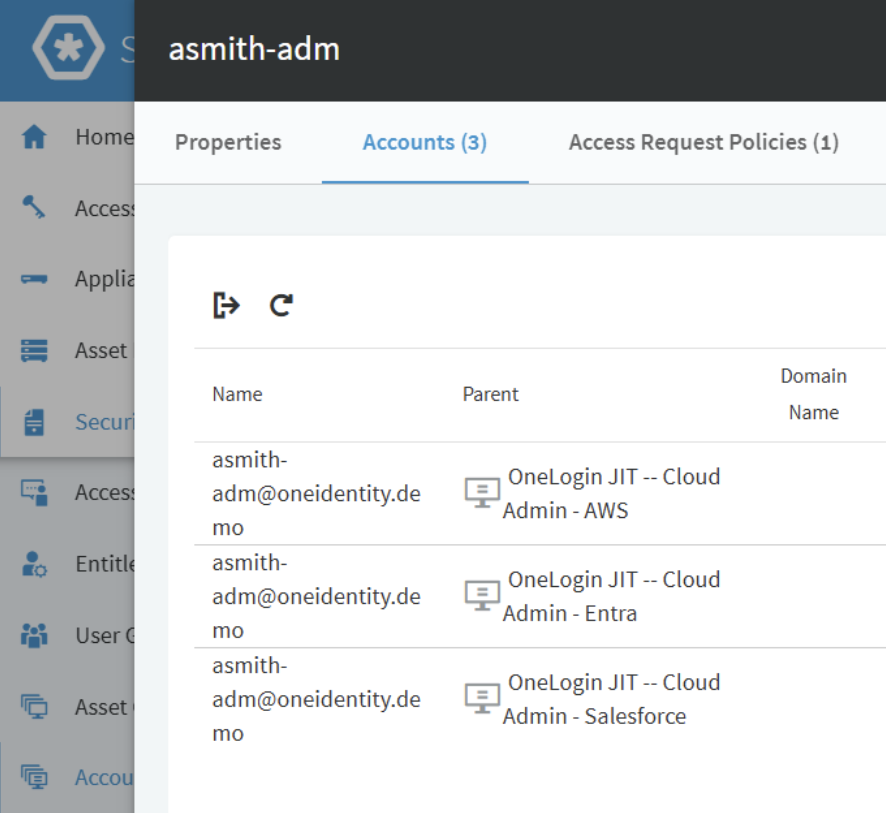 | The account group automatically discovers accounts across all three JIT assets. |

### Step 7 — Configure Entitlements and Access Request Policies

Create entitlements that tie together users, access request policies, and the JIT accounts.

| Screenshot | What it shows |
| --- | --- |
| 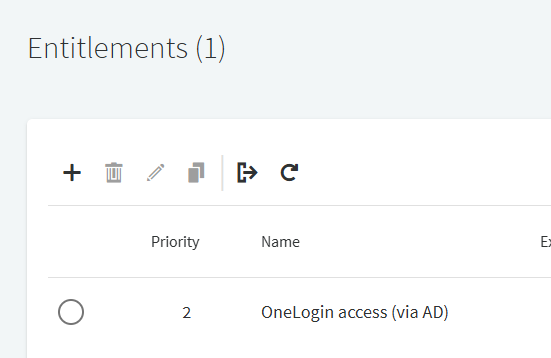 | The "OneLogin access (via AD)" entitlement. |
| 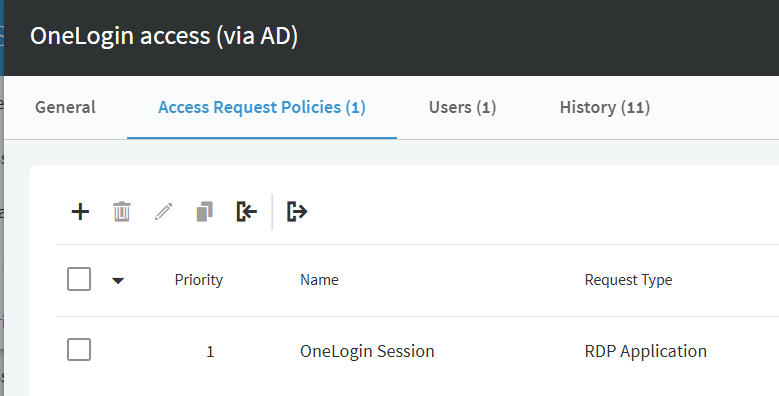 | Two access request policies: "OneLogin Session" (RDP Application) and "Cloud Admin JIT" (Password). |
| 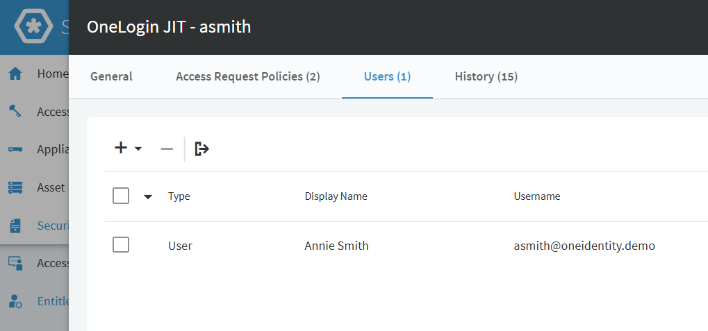 | The entitlement assigned to user Annie Smith (asmith@oneidentity.demo). |

### Step 8 — Configure Access Request Policy Details

Set security options and scope for the JIT password policy.

| Screenshot | What it shows |
| --- | --- |
| 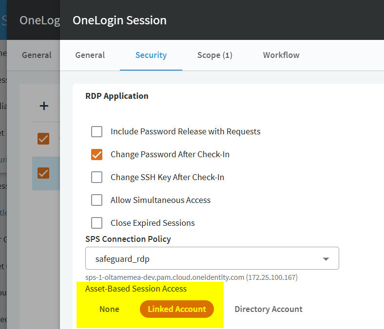 | The "OneLogin Session" policy with "Change Password After Check-In" enabled, SPS Connection Policy set, and "Asset-Based Session Access" using a Linked Account. |
| 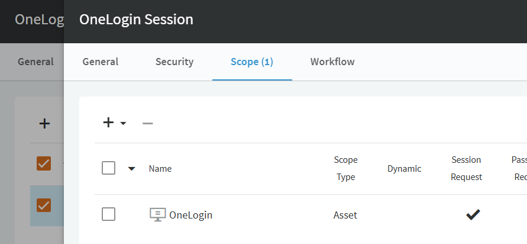 | The policy scoped to the base OneLogin asset. |
| 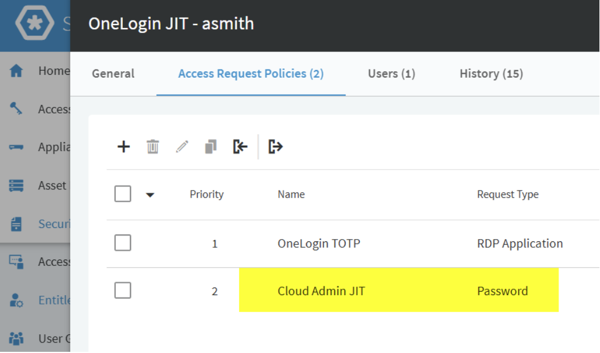 | The "Cloud Admin JIT" policy (Password type) added to the entitlement. |
| 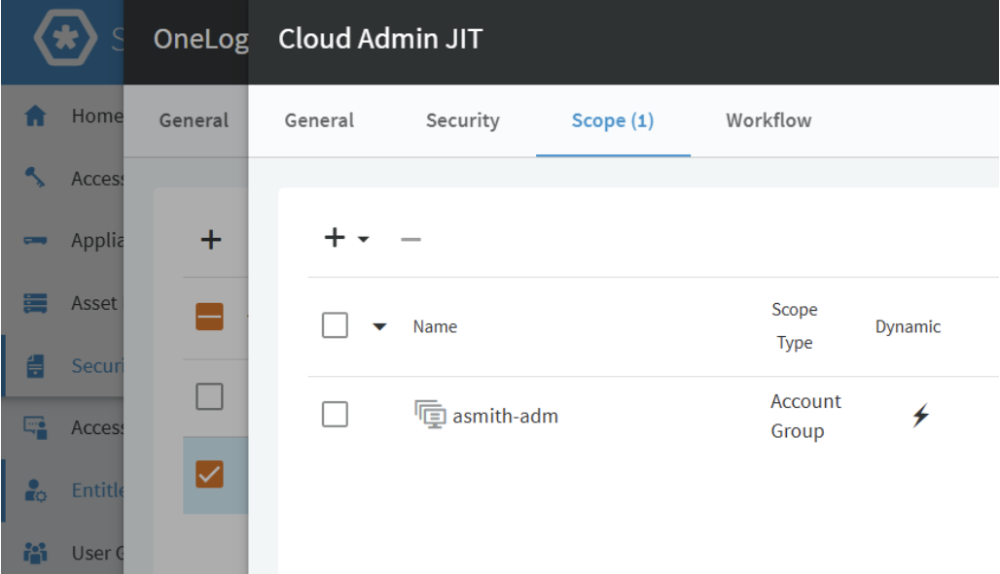 | The Cloud Admin JIT policy scoped to the `asmith-adm` account group (dynamic). |

### Step 9 — Verify the End-User Experience

After configuration, the user sees all available access requests including JIT elevation targets.

| Screenshot | What it shows |
| --- | --- |
| 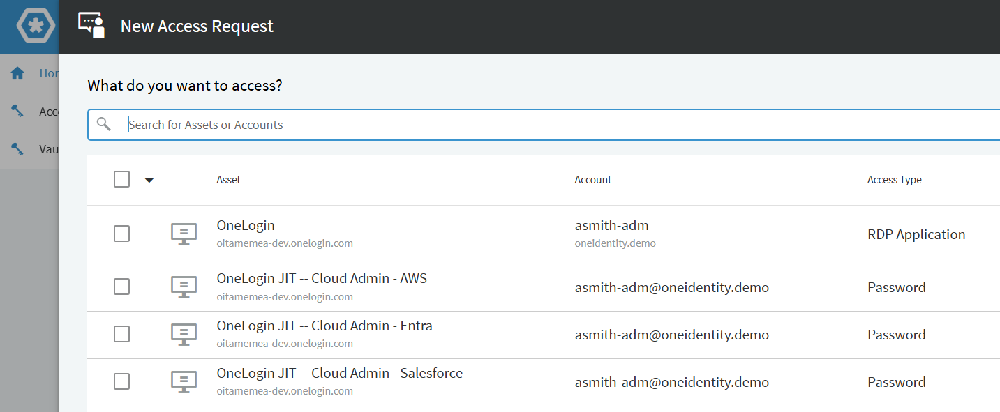 | The end-user "New Access Request" screen showing all OneLogin JIT assets available for password checkout. |

### Video Walkthrough

A video demonstration is available at [`assets/http_oneloginjit_1.mp4`](assets/http_oneloginjit_1.mp4) showing the full workflow in action.

## How It Works

The script authenticates with `auth/oauth2/v2/token` using client credentials and stores the returned bearer token. For account lifecycle operations it looks up the OneLogin user by username and sends a `PUT` to `api/2/users/%UserId%` with the desired status. For role elevation and demotion it resolves each role name to a role ID, adds or removes the user with `api/2/roles/%RoleId%/users`, and repeatedly checks role membership with `api/2/roles/%RoleId%/users?name=%Username%` until the change is visible. At the end of each run it revokes the access token with `auth/oauth2/revoke`.

## Parameters

- `PrivilegeGroupMembership`: Array of OneLogin role names to grant during elevate and remove during demote.
- `RetryIntervalSeconds`: Delay between role-membership verification polls. Default: `5`.
- `HttpProxyUri`, `HttpProxyPort`, `HttpProxyUserName`, `HttpProxyPassword`: Optional outbound proxy settings used on API calls.
- `SkipServerCertValidation`: Controls TLS certificate validation.

## Limitations

- `ChangePassword` is intentionally unsupported; OneLogin accounts in this design are expected to use TOTP or other non-password flows.
- The role-verification loop has no maximum retry count, so a stuck downstream provisioning problem can leave an elevate or demote task pending indefinitely.
- If one configured role cannot be found or updated, the script logs the failure and continues with the next role. Review extended logs carefully when multiple roles are requested.
- `ElevateAccount` requires the user to already be active; inactive users are rejected before any role assignment is attempted.

## Related

- [JIT elevation guide](../../../docs/guides/jit-elevation.md)
- [HTTP platform patterns](../../../docs/guides/http-platforms.md)
- [Reserved parameters reference](../../../docs/reference/reserved-parameters.md)
- [Testing and debugging](../../../docs/guides/testing-and-debugging.md)
